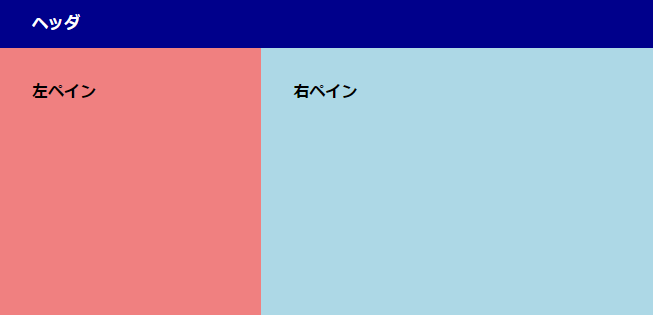

# Q1

[サンプル実装](./sample-implementation/q1.html)

## 目標

- ヘッダ内に適切にナビゲーションを設置できること
- `<input>` タグに適切にスタイルを設定できること
- 左右に分かれたページレイアウトを作成できること

## ページサイズ

縦 250 px 以上、横 500 px 以上で動作するようにしてください

## 実装上の注意

- 検索ボックスにフォーカスすると、色が滑らかに変化します
- ヘッダのリンクをホバーすると、色が滑らかに変化します
- ヘッダ右側の白丸はプロフィールアイコンを想定しています。画像はサンプル実装の白丸をクリックすることでダウンロードできます
- スクロールは右ペインのみ有効です。左ペインやヘッダーはスクロールしません

## ヒント

### 大まかなレイアウトを組む

まず、ヘッダ、左ペイン、右ペインの配置をどのように実装するかを考えましょう。通常フロー、Flexbox、Grid Layout などの選択肢がありますが、それぞれの場合でどのように書けるかを考え、どれが適切かを選択します。この時、それぞれの要素に適当な `background-color` を割り当てておくことで、レイアウトが分かりやすくなります。

次に、それぞれの要素 (ヘッダ、左ペイン、右ペイン) の子要素について、同じ操作を繰り返します。これによって、1 つのページをパーツの組み合わせとして見ることができるでしょう。

この時、ページサイズを変化させたときにうまく動くかどうかも同時に考えることが大事です。サンプル実装では、ある程度以上の横幅になったときに右ペインの挙動が少し変化しています。

### インライン要素における書字方向の配置

インライン要素を横方向 (書字方向) に並べた時、標準では文字のベースライン (文字の下線) が揃うようになっています。文字を含まないインライン要素 (`img` など) では、要素の下端がベースラインとして扱われます。

インライン要素の書字方向の配置は、`vertical-align` プロパティによって設定します。[https://developer.mozilla.org/ja/docs/Web/CSS/vertical-align](https://developer.mozilla.org/ja/docs/Web/CSS/vertical-align)

### スクロールの扱い

実装上の注意に書いた通り、ヘッダと左ペインはスクロールせず、右ペインのみスクロールします。`overflow-y` プロパティを活用してください。[https://developer.mozilla.org/ja/docs/Web/CSS/overflow-y](https://developer.mozilla.org/ja/docs/Web/CSS/overflow-y)

### box-sizing

通常、CSS では `width` には `padding` や `border` は含まれません。そこで、 `box-sizing: border-box` を指定することで、`width` に `padding` と `border` が含まれるようになります。

他の要素に与える影響を考えるとき、`width` または `height` と `margin` のみを考えればよいため、より分かりやすいコーディングを行えます。

この設定を使用する場合、標準スタイルの影響を受けないように、CSS に `* { box-sizing: border-box; }` を指定することをお勧めします。

### `<body>` の `margin`

標準では、`<body>` 要素には `margin` が設定されています。ブラウザいっぱいのサイズを指定したいときに注意してください。[https://developer.mozilla.org/ja/docs/Web/CSS/box-sizing](https://developer.mozilla.org/ja/docs/Web/CSS/box-sizing)
